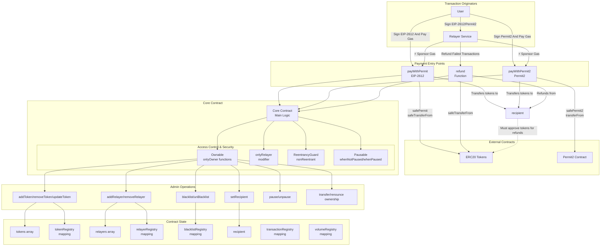

# Core Protocol

[](https://opensource.org/licenses/MIT)
[](https://github.com/CosineLabsHQ/core/actions)
[](https://github.com/CosineLabsHQ/core/actions)
[](https://github.com/CosineLabsHQ/core/actions)

Core is a gasless payment protocol that enables token transfers using EIP-2612 Permit and Permit2 standards without requiring prior on-chain approvals.

## Overview

The Core protocol allows users to make token payments through cryptographic signatures instead of traditional on-chain approvals. This enables gasless transactions where users sign permits off-chain, and a relayer executes the transactions on their behalf.

## Architecture



## Key Features

### **Dual Permit Standards**

- **EIP-2612 Permit**: Native permit functionality for compliant tokens
- **Permit2**: Universal permit system supporting any ERC20 token

### **Multi-layered Security**

- **Reentrancy Protection**: Prevents recursive calls during state changes
- **Pausable Operations**: Emergency stop mechanism for critical situations
- **Blacklist System**: Ability to restrict malicious addresses
- **Nonce Management**: Built into EIP-2612 and Permit2 standards (prevents replay attacks)

### **Gasless Payment System**

- **Gasless Transactions**: Users sign permits off-chain (no gas cost for signature)
- **Gas Sponsorship**: Relayer sponsors transaction gas fees for seamless UX
- **High Gas Fallback**: During network congestion, users can opt to pay gas directly
- **Dynamic Strategy**: Automatically optimizes between sponsored and user-paid based on network conditions

### **Advanced Token Management**

- **Min/Max Amount Controls**: Configurable transfer limits per token
- **Dynamic Updates**: Update token limits without removing/re-adding tokens
- **Fee-on-Transfer Support**: Handles tokens with transfer fees by tracking actual received amounts

### **Refund Mechanism**

- Relayer-controlled refund process
- Automatic refunds for failed off-chain services delivery

## Contract Components

### Core Contract

The main contract that orchestrates all payment operations with the following responsibilities:

- **Payment Processing**: Handles both EIP-2612 and Permit2 payment flows with fee-on-transfer support
- **Token Management**: Advanced token configuration with min/max limits and dynamic updates
- **Access Control**: Multi-sig owner with flexible relayer/user gas payment model
- **Security**: Comprehensive protection against common attack vectors and front-running
- **Cross-chain Safety**: Transaction ID namespacing prevents cross-chain replay attacks

### Key Mappings

- `tokenRegistry`: Token configuration with min/max amounts and support status
- `relayerRegistry`: Authorized relayers that can sponsor gas and process refunds
- `blacklistRegistry`: Blocked addresses that cannot interact with the contract
- `transactionRegistry`: Complete record of all processed payments with received amounts and refund status
- `volumeRegistry`: Total of token transfer volumes per token

## Payment Flow

### EIP-2612 Permit Flow

1. **User Signs Permit**: Creates off-chain signature authorizing token transfer
2. **Request Signing & Submission**: Can be signed and submitted by either:
   - **Relayer** (sponsors gas during low-fee periods)
   - **User directly** (pays own gas)
3. **Validation**: Contract validates namespaced transaction IDs, transfer parameters, and token limits
4. **Safe Permit Execution**: Handles potential front-running with fallback to existing allowances
5. **Token Transfer**: Executes `_safeTransferFrom` and tracks actual received amount (handles fee-on-transfer tokens)
6. **Event Emission**: `Paid` event is emitted with actual received amount for off-chain tracking

### Permit2 Flow

1. **User Signs Permit2**: Creates off-chain signature using Uniswap's Permit2 standard
2. **Request Signing & Submission**: Request can be signed and submitted by either:
   - **Relayer** (sponsors gas during low-fee periods)
   - **User directly** (pays own gas)
3. **Validation**: Contract validates namespaced transaction IDs, token limits and transfer parameters
4. **Safe Permit2 Integration**: Handles permit front-running with allowance fallbacks
5. **Token Transfer**: Executes Permit2's `transferFrom` and tracks actual received amount (handles fee-on-transfer tokens)
6. **Event Emission**: `Paid` event is emitted for off-chain tracking

## Security Model

### Access Control Hierarchy

- **Owner (Multi-sig)**: Full administrative control
  - Token management (add/remove/update)
  - User blacklisting
  - Relayer management (add/remove)
  - Recipient updates
  - Emergency pause/unpause
- **Relayer**: Gas sponsorship and refund operations
  - Sponsor gas for user transactions during low-fee periods
  - Process refunds for failed transactions
- **Users**: Direct interaction capability
  - Can call payment functions directly (pay own gas)

### Security Mechanisms

- **Safe Transfer Implementation**: Custom assembly-based `_safeTransferFrom` handles non-compliant ERC20 tokens
- **Amount Validation**: Enforces token-specific min/max transfer limits
- **Address Validation**: Prevents self-transfers and validates recipients
- **Integrated Nonce Management**: EIP-2612 and Permit2 handle their own nonce systems for replay protection
- **Front-running Protection**: Safe permit implementations with allowance fallbacks
- **Cross-chain Safety**: Transaction namespacing prevents replay attacks across different chains
- **Fee-on-Transfer Handling**: Tracks actual received amounts for accurate accounting

### For Security Auditors

> **⚠️ Important Notice**  
> The relayer's ability to process refunds is intentional and necessary for user protection.

- Relayer only refunds when off-chain service delivery actually fails
- Users would not get their money without this auto-refund mechanism
- Refunds are one-time only per transaction
- All refunds are transparent and logged on-chain
- Relayer infrastructure uses industry-standard security practices

## Function Reference

### Payment Functions

#### `payWithPermit()`

Processes payments using EIP-2612 permit signatures. **Can be called by anyone** (relayer or user).

**Parameters:**

- `_request`: The EIP2612 payment request.
- `_signature`: Signature used to verify and authorize the payment request.
- `_requestType`: Type of request (1 = gasless, 2 = direct/gas)

**Access:** Public (flexible gas payment model)

#### `payWithPermit2()`

Processes payments using Permit2 signatures. **Can be called by anyone** (relayer or user).

**Parameters:**

- `_request`: The Permit2 payment request.
- `_signature`: Signature used to verify and authorize the payment request.
- `_requestType`: Type of request (1 = gasless, 2 = direct/gas)

**Access:** Public (flexible gas payment model)

#### `refund()`

Processes refunds for failed off-chain services (relayer only).

**Parameters:**

- `_user`: The address of the user who is receiving the refund.
- `_transactionId`: The unique identifier for the transaction.

**Access:** Relayer only.

### Administrative Functions

#### `pause()` / `unpause()`

Emergency controls to halt/resume contract operations.

#### `setRecipient()`

Update recipient address.

#### `addRelayer()` / `removeRelayer()`

Add or remove relayer from the designated relayers.

#### `blacklist()` / `unBlacklist()`

Manage user access restrictions.

#### `addToken()` / `removeToken()`

Add or remove tokens from the supported tokens.

#### `updateToken()`

Update minimum and maximum transfer amounts for existing supported tokens without removing them.

#### `transferOwnership()`

Transfer contract ownership to another address (multi-sig).

#### `renounceOwnership()`

Renounce contract ownership to `address(0)`. After renounce you will not be able to perform administrative operations again.

## Events

| Event                  | Description                    | Parameters                                         |
| ---------------------- | ------------------------------ | -------------------------------------------------- |
| `Paid`                 | Token payment completed        | `user`, `token`, `receivedAmount`, `transactionId` |
| `Refunded`             | Payment refunded               | `user`, `token`, `receivedAmount`, `transactionId` |
| `Blacklisted`          | Address blacklisted            | `user`                                             |
| `UnBlacklisted`        | Address removed from blacklist | `user`                                             |
| `RecipientTransferred` | Recipient address updated      | `oldRecipient`, `newRecipient`                     |
| `RelayerAdded`         | New relayer added to relayers  | `relayer`                                          |
| `RelayerRemoved`       | Relayer removed from relayers  | `relayer`                                          |
| `TokenAdded`           | New token added to tokens      | `token`                                            |
| `TokenRemoved`         | Token removed from tokens      | `token`                                            |
| `TokenUpdated`         | Token limits updated           | `token`                                            |

## Gas Optimization

- **Assembly Usage**: Custom `_safeTransferFrom` reduces gas costs
- **Efficient Storage**: Optimized state variable packing and struct layouts
- **Safe Permit Patterns**: Efficient front-running protection without extra gas waste
- **Event-driven Architecture**: Off-chain indexing reduces on-chain queries

## Test

```bash
git clone --recurse-submodules https://github.com/CosineLabsHQ/core.git
cd core
npm install
npx hardhat test
npx hardhat coverage
```

## Deployment

### Safe Multi-sig Deployment (Mainnet)

The recommended deployment method uses Safe multi-signature wallets for enhanced security.

#### Prerequisites

- Create [Safe](http://app.safe.global/) wallets for both contract owner and recipient
- Obtain API key from [Safe Developer Portal](https://developer.safe.global/)
- Ensure you have signing access to one of the Safe wallets

#### Setup

Clone the repository and install dependencies:

```bash
git clone --recurse-submodules https://github.com/CosineLabsHQ/core.git
cd core
npm install
cp .env.safe.example .env
```

Configure environment variables in `.env`:

```bash
CHAIN_ID=137                                   # Target chain ID (e.g., 137 for Polygon)
CHAIN_RPC_URL="https://your-rpc-endpoint"      # RPC endpoint URL
PRIVATE_KEY="your_private_key_here"            # Safe signer's private key
SAFE_ADDRESS="0x..."                           # Safe wallet address (owner)
SAFE_API_KEY="your_api_key"                    # Safe API key
ETHERSCAN_API_KEY="your_etherscan_api_key"     # For contract verification (multi-chain)
```

#### Configuration

Update deployment parameters in `scripts/safe/utils/deployment.ts` according to your target chain:

```typescript
const args = {
  tokens: [
    {
      token: '0x3c499c542cEF5E3811e1192ce70d8cC03d5c3359', // USDC (Polygon example)
      minAmount: ethers.parseUnits('0.5', 6),
      maxAmount: ethers.parseUnits('1000', 6)
    },
    {
      token: '0x2791Bca1f2de4661ED88A30C99A7a9449Aa84174', // USDC.e (Polygon example)
      minAmount: ethers.parseUnits('0.5', 6),
      maxAmount: ethers.parseUnits('1000', 6)
    },
    {
      token: '0xc2132D05D31c914a87C6611C10748AEb04B58e8F', // USDT (Polygon example)
      minAmount: ethers.parseUnits('0.5', 6),
      maxAmount: ethers.parseUnits('1000', 6)
    }
  ],
  relayers: ['0xf51ecc190b29816fb2ab710615837c67b1e70a5e'], // Your authorized relayer addresses
  permit2: '0x000000000022D473030F116dDEE9F6B43aC78BA3', // Uniswap Permit2 (same across chains)
  recipient: '0x010B4D4D4a8faCb95eC3416c9FaC708FC190Bf60', // Safe address (multi-sig)
  owner: SAFE_ADDRESS // Safe address (multi-sig)
};
const deployment = await Core.getDeployTransaction(
  args.tokens,
  args.relayers,
  args.permit2,
  args.recipient,
  args.owner
);
```

> **Important:** Update token addresses to match your target chain. The example above shows Polygon addresses. Permit2 address (`0x000000000022D473030F116dDEE9F6B43aC78BA3`) is consistent across all supported chains.

#### Deployment Commands

Deploy the contract:

```bash
npx hardhat run scripts/safe/deploy.ts --network custom
```

The deployment script will output the transaction hash and deployed contract address:

```
Transaction hash: 0x...
Contract successfully deployed at: 0x889712abd70699456F6Fe403B5066e5796FA1050
```

Verify the contract on block explorer using the deployed address:

```bash
DEPLOYED_ADDRESS=0x889712abd70699456F6Fe403B5066e5796FA1050 npx hardhat run scripts/safe/verify.ts --network custom
```

> **Note:** Replace `0x889712abd70699456F6Fe403B5066e5796FA1050` with your actual deployed contract address from the deployment output.

### Hardhat Ignition Deployment (Testnet)

Alternative deployment method using Hardhat Ignition, suitable for development and testing environments.

#### Setup

Clone the repository and install dependencies:

```bash
git clone --recurse-submodules https://github.com/CosineLabsHQ/core.git
cd core
npm install
cp .env.ignition.example .env
```

Configure environment variables in `.env`:

```bash
CHAIN_ID=97                                    # Target chain ID (e.g., 97 for BSC Testnet)
CHAIN_RPC_URL="https://your-rpc-endpoint"      # RPC endpoint URL
PRIVATE_KEY="your_private_key_here"            # Deployer private key
ETHERSCAN_API_KEY="your_etherscan_api_key"     # For contract verification
```

#### Configuration

Update deployment parameters in `ignition/modules/Core.ts` according to your target chain:

```typescript
const core = instance.contract('Core', [
  [
    {
      token: '0x5Bc72e927B8E9d7D4785474bC4dB6CF2615f3f79', // USDT (BSC Testnet example)
      minAmount: ethers.parseUnits('0.5', 6),
      maxAmount: ethers.parseUnits('1000', 6)
    },
    {
      token: '0x3d4E32d10E3BDae808551E0205B46Aa8543D2EB7', // USDC (BSC Testnet example)
      minAmount: ethers.parseUnits('0.5', 6),
      maxAmount: ethers.parseUnits('1000', 6)
    },
    {
      token: '0x7adC5d6a00d6b18BB7f95f0E7dD9d102b02e1E49', // DAI (BSC Testnet example)
      minAmount: ethers.parseUnits('0.5', 6),
      maxAmount: ethers.parseUnits('1000', 6)
    }
  ],
  ['0xf51ecc190b29816fb2ab710615837c67b1e70a5e'], // Authorized relayer addresses
  '0x000000000022D473030F116dDEE9F6B43aC78BA3', // Uniswap Permit2 (same across chains)
  '0x4077f2b63aDd0BE9D1e332a26c15D2Decf1C3792', // Payment recipient address
  '0x8FccCF3CFaF5772F6F6380044D40763567e80B4c' // Contract owner address
]);
```

> **Important:** Update token addresses, relayer addresses, recipient, and owner addresses to match your target chain. BSC Testnet addresses are shown as examples.

#### Deployment Commands

Deploy and verify the contract in a single command:

```bash
npx hardhat ignition deploy ignition/modules/Core.ts --network custom --verify
```

The deployment will automatically handle contract verification if the `--verify` flag is provided and `ETHERSCAN_API_KEY` is configured.

## Acknowledgments

- Smart contracts: [Solidity](https://soliditylang.org)
- Permit standards: [EIP-2612](https://eips.ethereum.org/EIPS/eip-2612), [Permit2](https://github.com/Uniswap/permit2)
- Request signing: [EIP-712](https://eips.ethereum.org/EIPS/eip-712)
- Relayer infrastructure: [openzeppelin-contracts Relayer](https://github.com/OpenZeppelin/openzeppelin-relayer)

## License

MIT License - See LICENSE file for details.

## Contact

**Cosine Labs Inc.**

- Email: engineering@getcosine.app
- Website: https://getcosine.app

---

Copyright (c) 2025 Cosine Labs Inc.
